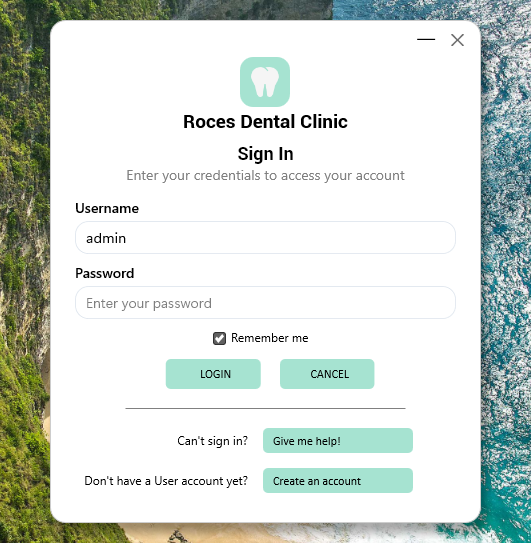
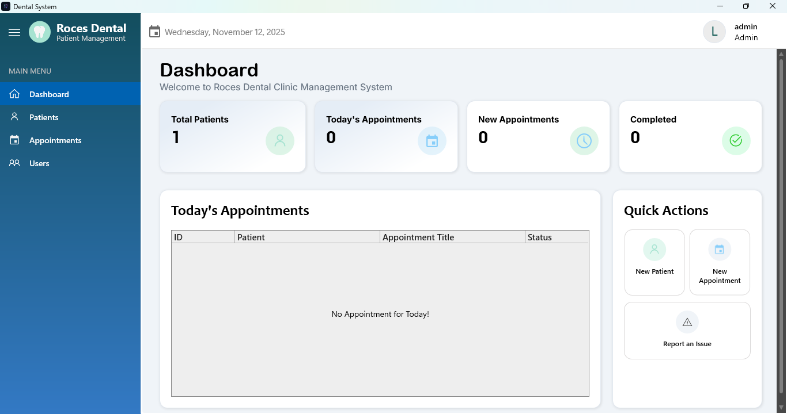

# Roces Dental Patient Management System

  

## Overview

**Roces Dental Patient Management** is a Windows application designed for dental clinics to efficiently manage patient records and appointment schedules. Built with Delphi and SQLite by a Computer Engineer, this system provides a clean and intuitive workflow for your clinic.

## Features

- Patient registration and profile management
- Appointment scheduling and tracking
- Dashboard with appointment and patient statistics
- User authentication (login system with admin and user roles)
- Secure data storage using SQLite
- Simple installation and upgrade process

## Screenshots

*Login Form:*

*Main Dashboard:*

  

## Installation

1. Download the latest installer from the [Output](#) section or use the provided setup file.
2. Run the installer (`Roces Dental setup.exe`) and follow the on-screen instructions.
3. By default, user data (the SQLite database) is stored in your user's AppData folder to prevent data loss on updates or uninstall.

## Getting Started

- Launch the application from your desktop or start menu.
- On the **login screen**, enter your username and password (default admin account: `admin`). If you don’t have an account, use the **Create an account** option.
- If you can't sign in, click **Give me help!** on the login form for assistance.
- Start creating patients and appointments using the main menu.

## Data Backup & Restore

- The main database is located at `%AppData%\Roces Dental\dental.db`.
- Make regular backups of this file to secure your clinic data.

## Support

For installation help, issues, or feature requests, please contact:

For installation help, issues, or feature requests, please contact:
- **Developer:** Lance Madel S. Esureña, Software Developer / Computer Engineer
- **Support**: [Facebook Page](https://web.facebook.com/profile.php?id=61575330703840)

## License

This software is provided for clinic or educational use. Modification and redistribution require permission from the author.
